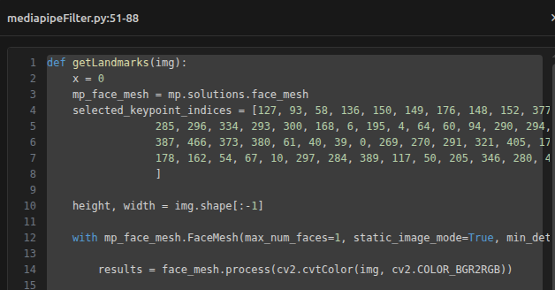

# CoGraph

[](https://github.com/thraenbe/cograph/actions/workflows/ci.yml)
[](https://marketplace.visualstudio.com/items?itemName=thraenbe.cograph)
[](https://marketplace.visualstudio.com/items?itemName=thraenbe.cograph)
[](https://marketplace.visualstudio.com/items?itemName=thraenbe.cograph&ssr=false#review-details)
[](LICENSE)

> Visualize your Python, TypeScript, JavaScript, Java, or C++ project as an interactive call graph — functions are nodes, calls are edges. Navigate your codebase by clicking. No configuration required.

When AI writes the code, humans need a better way to understand it. CoGraph is the situational-awareness layer for agentic development: a real-time, multi-dimensional map of what is being built in your project.



<!-- TODO(maintainer): replace the static screenshot above with an animated demo GIF at docs/images/demo.gif showing "CoGraph: Visualize Project" → navigating the graph. -->

## Install

- **VS Code Marketplace:** [marketplace.visualstudio.com/items?itemName=thraenbe.cograph](https://marketplace.visualstudio.com/items?itemName=thraenbe.cograph)
- **From the Extensions view:** open Extensions (`Ctrl/Cmd+Shift+X`), search **CoGraph**, and click *Install*.
- **Command line:**
  ```bash
  code --install-extension thraenbe.cograph
  ```

## Quick start (30 seconds)

1. Open any Python, TypeScript, JavaScript, Java, or C++ project folder in VS Code.
2. Open the Command Palette (`Ctrl+Shift+P` / `Cmd+Shift+P`).
3. Run **`CoGraph: Visualize Project`**.

The call graph opens in a side panel. Click a node to jump to its definition; use the
toolbar to toggle overlays.

## Features

- **Static analysis, zero config** — extracts the call graph using each language's native tooling: Python's built-in `ast`, the TypeScript compiler API, `java-parser` for Java, and `web-tree-sitter` for C++. No runtime instrumentation, no setup.
- **Interactive graph** — zoom, pan, drag nodes, and filter by function name.
- **Click-to-navigate** — click any node to open the file and jump to the function definition.
- **Function source popup** — click a node to open a draggable, resizable popup showing syntax-highlighted source code; multiple popups can be open simultaneously.
- **OOP class overlay** — visualize class hierarchies, fields, and methods; toggle with the **Class** button.
- **Folder/file structure overlay** — hierarchical grouping by directory with drag/resize support; toggle with the **Folder** button.
- **Git integration** — color nodes by their git status (modified, new, deleted, staged); toggle with the **Git** button.
- **Language coloring** — color nodes by file/language; toggle with the **Language** button.
- **Library node clustering** — external library calls are grouped into collapsed cluster nodes (e.g. `numpy (7)`) to prevent visual clutter; click a cluster to expand it.
- **Detail / Complexity slider** — progressively cluster low-connectivity nodes to keep large projects navigable.
- **Save Layout** — persist node positions to `.cograph/<name>.json`; reopen the same graph and pick up where you left off.
- **Open Chat** — focus the Cograph activity-bar view with the active graph already selected (foundation for the upcoming Graph Intelligence layer).
- **Settings panel** — tune layout forces (center, repel, link strength, link distance), display options (node size, text size, link thickness, arrows), and visibility toggles (orphan nodes, library nodes).

## Coming soon — Graph Intelligence (Premium)

A planned AI-powered layer on top of the graph: natural-language questions about your architecture, anomaly highlighting, dead-code detection, and integrated refactoring suggestions. Configurable to run against either Claude Code or OpenAI Codex CLI, with per-request budget and turn caps. Scaffolding is already in the extension; the feature is gated until launch.

## Requirements

- VS Code 1.75+
- **Python projects:** Python 3.x available (via `python3`, a virtual environment, or the VS Code Python extension)
- **TypeScript / JavaScript projects:** Node.js — no additional configuration needed
- **Java projects:** no extra runtime — the analyzer ships with a pure-JS parser
- **C++ projects:** no extra runtime — the analyzer ships with a tree-sitter WebAssembly grammar

## Usage

1. Open a Python, TypeScript, JavaScript, Java, or C++ project folder in VS Code.
2. Open the Command Palette (`Ctrl+Shift+P` / `Cmd+Shift+P`) and run **`CoGraph: Visualize Project`**.
3. The call graph opens in a side panel.
4. Use the search bar to filter functions by name (`Ctrl+F` / `Cmd+F` focuses it).
5. Click any node to navigate to its definition, or view its source in a popup.
6. Toggle **Git** or **Language** coloring with the buttons in the top-left.
7. Toggle the **Class** button to overlay OOP class hierarchy and field information.
8. Toggle the **Folder** button to overlay the directory/file structure as collapsible groups.
9. Use the **Complexity** slider to collapse less-connected nodes on large graphs.
10. Click **Save Layout** to persist the current node positions, or **Open Chat** to focus the Cograph activity-bar view with this graph selected.
11. Open the **Settings** panel (gear icon) to adjust layout and display options.

## Troubleshooting

- **The graph is empty.** Make sure the open folder actually contains source files in a
  supported language. For Python, confirm a `python3` interpreter is resolvable (a
  virtual environment or the VS Code Python extension is enough).
- **Python projects show nothing on Linux.** If VS Code is installed as a **snap**, its
  bundled runtime can interfere with analyzers — a deb/tarball install of VS Code avoids
  this. (CoGraph's bundled analyzers are pure-JS/WASM specifically to minimize this.)
- **A large repo feels heavy.** Use the **Complexity** slider or the search filter; the
  graph also engages folder-level clustering automatically on big projects.
- **Some calls are missing.** Dynamic dispatch, `eval`, and computed/runtime-generated
  calls are not statically resolvable — see *Limitations*.

## Limitations

- Dynamic dispatch and runtime-generated functions are not tracked.
- Cross-package call edges (into installed libraries) are intentionally excluded — external calls are surfaced through library cluster nodes instead.
- TypeScript / JavaScript analysis covers static call sites; dynamic patterns (e.g. `eval`, computed property calls) are not tracked.
- Java and C++ analysis covers statically resolvable calls; macro-heavy or template-heavy C++ code may produce a partial graph.
- Very large projects may require the Complexity slider or search filter to navigate comfortably.

## Contributing

Contributions are welcome! See **[CONTRIBUTING.md](CONTRIBUTING.md)** for local setup,
build/test instructions, and the PR process. Please also review our
[Code of Conduct](CODE_OF_CONDUCT.md). For bugs and ideas, use the
[issue tracker](https://github.com/thraenbe/cograph/issues); for questions and sharing,
use [Discussions](https://github.com/thraenbe/cograph/discussions).

## Security

Found a vulnerability? Please report it privately — see **[SECURITY.md](SECURITY.md)**.

## License

[MIT](LICENSE) © Bela Thrän
